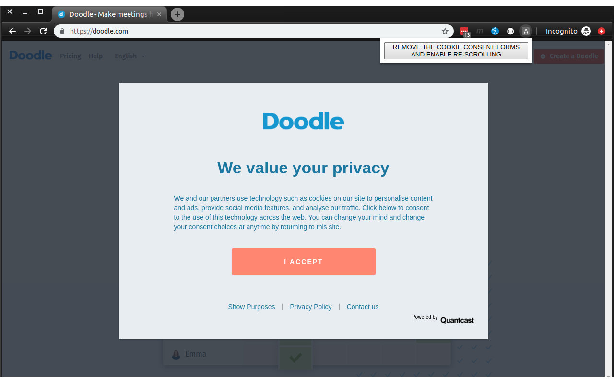

# About
A Google Chrome extension removing the annoying cookie consent form without consenting to cookies.

# Installation
<ol>
    <li> Download and unpack the zip file or clone the repo.
    <li> Go to <tt>chrome://extensions/</tt> and check the box for <tt>Developer mode</tt> in the top right.
    <li> Click on <tt>Load unpacked</tt> and select the extension folder.
</ol>

# Usage
The cookie consent form removal is triggered by clicking on the extension icon and then on the popup button.
See the screenshot below.

# Version
0.0.1 (published on 18.06.2019)

